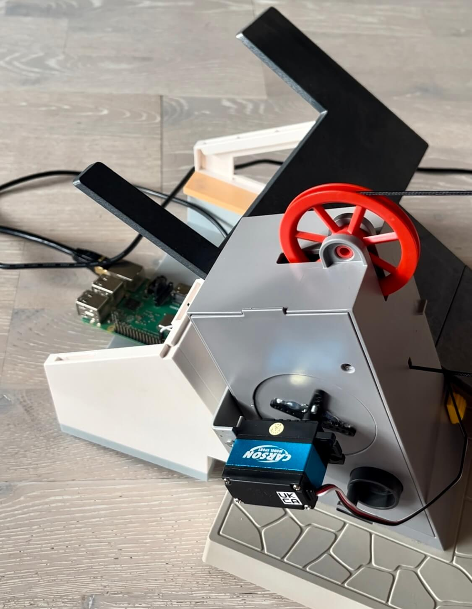
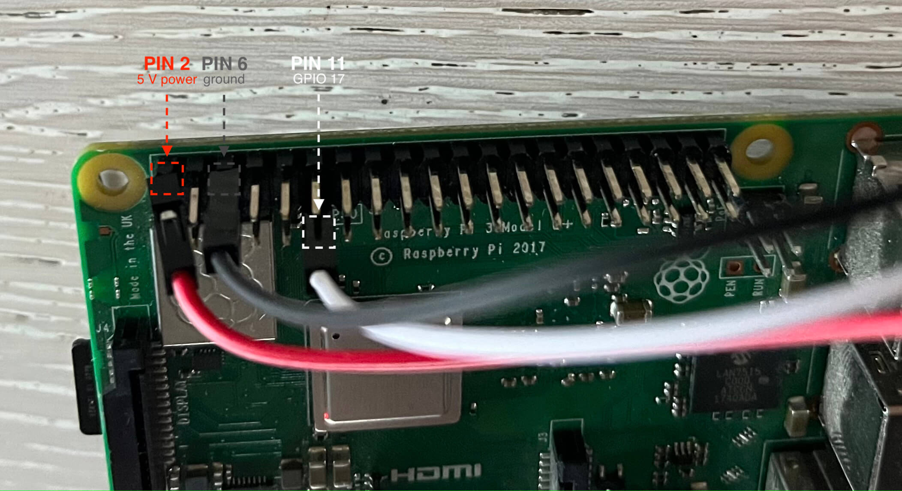
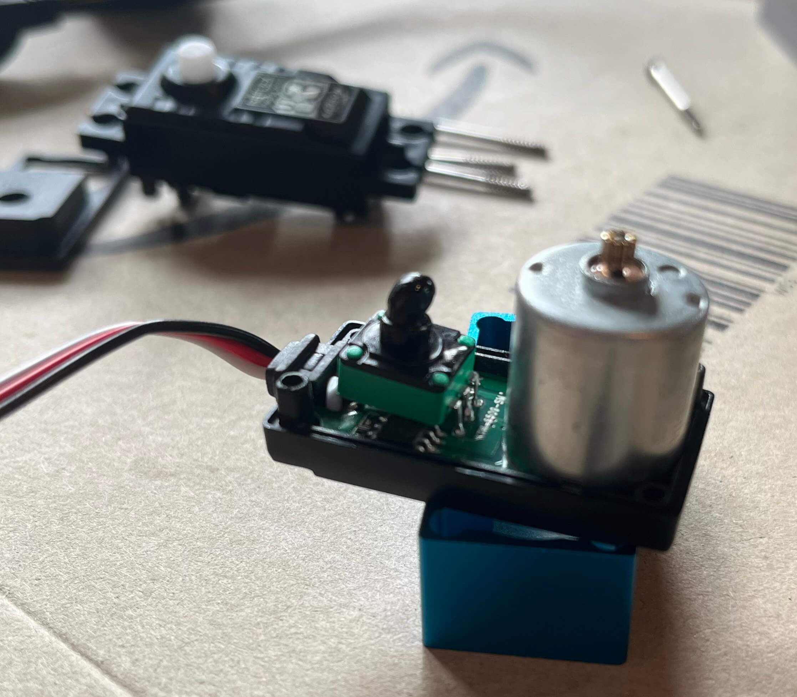
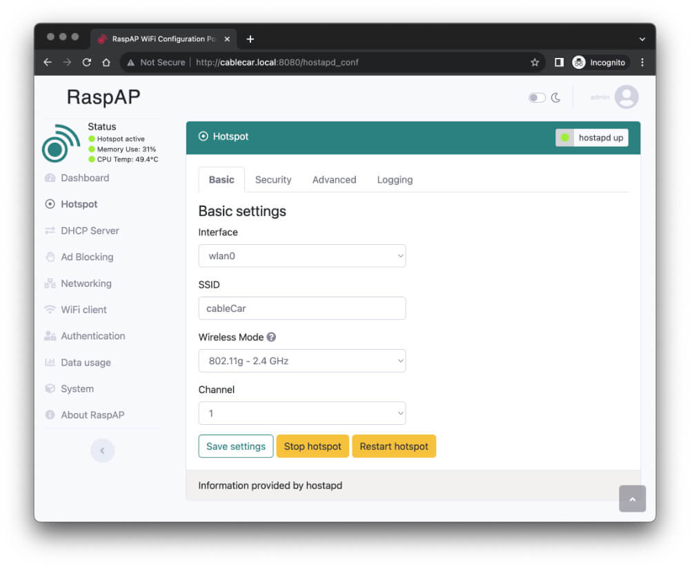
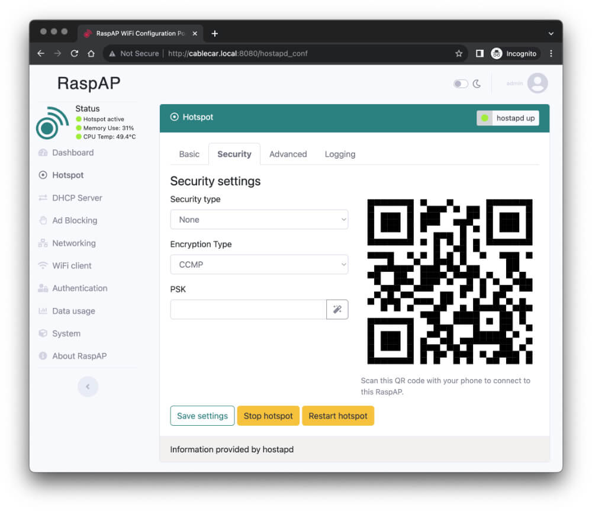
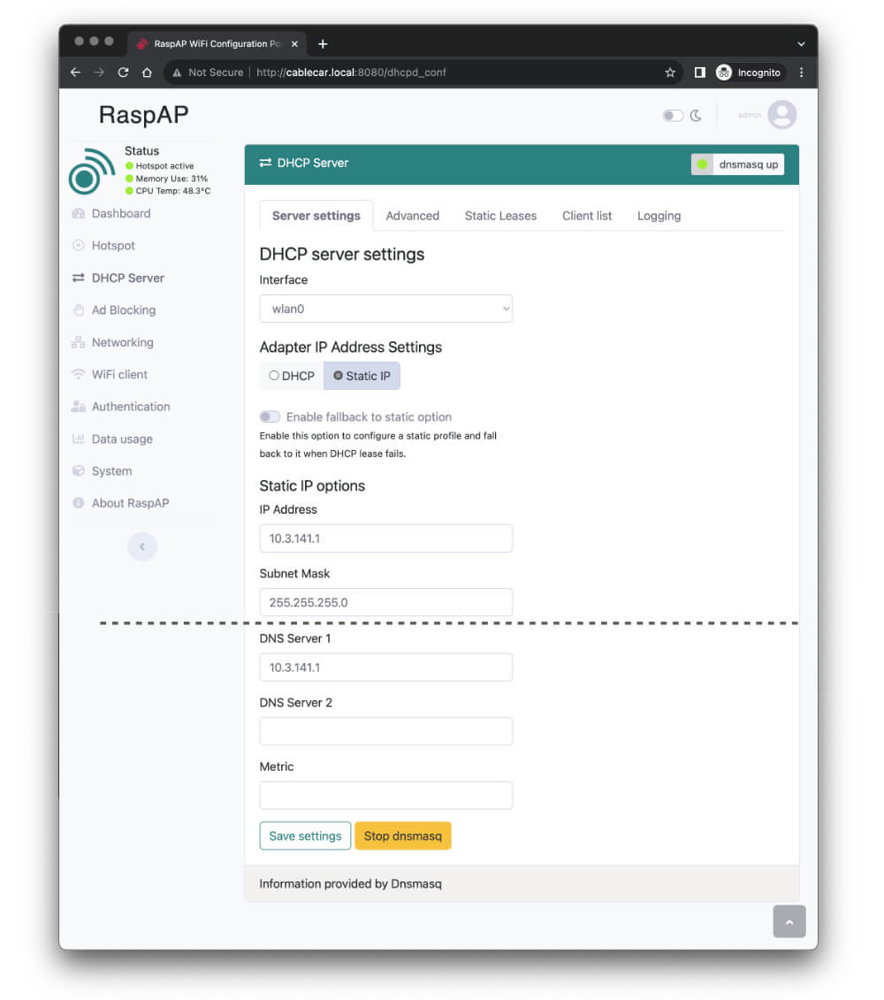

## TL;DR

I created an access point on the RPi and forwarded all traffic to the local web server.
The redirect is done by providing a custom DNS which redirects all traffic to itself.
On the website you can control the servo connected to the GPIO pins via python.

## Background

Currently I have a servo connected to my RPi which should be controlled via smartphone.
For sure the easiest way is just connect the Raspberry Pi with your home network and connect via IP address given from your DHCP to the RPi.

But in my setup this Raspberry is not always connected to the network and should be independently controllable.
Therefore I needed to go for another solution.

The whole setup is to be seen as a temporary environment and is only given as a fun attraction for a party to control a cable car via smartphone.
Therefore I did not care about security or other things.
As you can imagine this is not a solution for production environments.

## Video

The video shows the finished solution which is documented in this article.



## Solution

The given situation is that I want to controll a [PlayMobile cable car](https://www.playmobil.ca/en/mountain-cable-car/9830.html) via Pi.
Therefore I use a servomotor which was turned into a 360 degree servo to winding and unwinding the rope from the winch.
This device is then mounted to the valley station of the toy.



In the next sections every step will be described in detail how the setup was created.

### Hardware

#### Raspberry Pi

The hardware is pretty simple.
I use a Raspberry Pi 3B+ with a [servo motor](https://amzn.to/3tfThJz) connected to the [GPIO pins](https://www.raspberrypi.com/documentation/computers/raspberry-pi.html#gpio-and-the-40-pin-header) - but you can also use other devices.
The servo is powered by the 5V ([pin 2](https://pinout.xyz/pinout/5v_power), red) and the ground pin (pin 6, [black](https://pinout.xyz/pinout/ground)).
The signal pin (white) is connected to [GPIO 17 (pin 11)](https://pinout.xyz/pinout/pin11_gpio17/).



#### Server motor

The servo motor is a modified servo which can be turned into a 360 degree.
This is done by removing the mechanical stopper inside the servo.
With this modification the servo will also be able to turn around multiple times.



You will find instructions on the internet how to modify your servo.
I was watching [this video](https://www.youtube.com/watch?v=JhHSXCLsN4k) to modify my servo.

After removing the blocking part I also needed to fix the rotation.
Therefore I melted the pin after adjusting the rotation to the correct position.
You will find the correct position when the motor stops spinning (see video).

You might find better solutions to do that - but this was the easiest way for me with limited election skills.

### Software

You find the source code of this project in the repo [taskmedia/piCableCar](https://github.com/taskmedia/piCableCar).
I checked the reository into the `/opt` directory of the Raspberry Pi.

#### Website

To control my servomotor I created a small website which is hosted on the Raspberry Pi.
When accessing a page there are three buttons to control the connected device: "up", "down" and "stop".
When a button is clicked the python script connects to the GPIO pin and sends the signal to control the servo.

This website is hosted locally on the RPi at port 80 with [Flask](https://pypi.org/project/Flask/).
To control the servomotor I use the [RPi.GPIO](https://pypi.org/project/RPi.GPIO/) library.

Accessing this website is possible when connection to the IP address or using the hostname in the local network.

To ensure the python script is always running I created a systemd service which is started on boot.

#### Access point

But for my usecase the local network is mostly not available and the website then can not be reached within the home network.
Therefore I created an access point on the Raspberry Pi which allows you to connect to the RPi directly and create its own network.

When connected to the access point the website is then available in this network when accessing the IP address of the Pi itself.

To create the access point I used [RaspAP](https://raspap.com/).
This is a web interface which allows you to create an access point on the Raspberry Pi (similar to your router at home).
It also allows you to configure the DHCP server and a DNS server for ad blocking with a denylist.

#### DNS server

When connecting to the Pi via the access point you manually need to enter the IP address.
This might not be easy and straightforward for everyone and therefore I used the given DNS server from RaspAP to redirect all traffic to the IP address of the Pi.

This will result in the following behavior:
On your smartphone you connect to the WiFi of the Raspberry Pi.
When connected a (splash) screen will be automatically presented.
You migt know this website which will mostly be displayed in WiFis at a hotel to enter your name / room number to verify you actually are a guest.
Instead of clicking this obvious connect button you will directly be presented with the servo control website hosted on the RPi.

Even when the website is not shown all browser requests will be forwarded to the local web server.
This might not be best or safest soluton by sending wrong ip records - but easy to implement.
And since Internet access is not available in my setup either, every request would fail anyway.

## Setup

## Install RaspAP

Installing the access point is pretty easy.

```bash
curl -sL https://install.raspap.com | bash
```

During the run of the installation script you will be promted multiple times.
I accepted every installation except the VPNs (OpenVPN, WireGuard).
Ensure the ad blocking is installed (DNS).

After the installation you can access the web interface on port 80.
To be able to run the python web server on port 80 we need to change this to e.g. 8080.
Therefore edit the `server.port` parameter in `/etc/lighttpd/lighttpd.conf` to your desired port.
Reboot or just restart the lighttpd service (`systemctl restart lighttpd.service`).

## Configure RaspAP

There are two ways to configure RaspAP.
The first section describes how to change it in the web interface the second how to change it directly in the filesystem.
You only need to follow one of the following sections.

### Configure RaspAP via web interface

After the installation is completed you can access the web interface.
In my case this is `http://cablecar.local:8080/`.
[RaspAP](https://docs.raspap.com/?h=secret#quick-start) is secured by BasicAuth with the credentials `admin:secret`.
You should change that in the settings later - but for now we just move on.

To customize the access point go to the _Hotspot_ menu.
Change the name of the SSID to your desired name - e.g. `cableCar`.


On the _Security_ tab you can change it to a diffenent type or even disable the security at all.


To ensure the DNS will used when connected to the WiFi go to the _DHCP Server_ menu and enter the IP address of the RPi of the wlan interface (`10.3.141.1`) as DNS server 1.
Due this change the ad blocking will be enabled but this will change later so every traffic will be _blocked_.



### Configure RaspAP via filesystem

If you want to change the settings of RaspAP via filesystem you need to modify two files:

In file `/etc/hostapd/hostapd.conf` change the value of the key `ssid` to your desired WiFi name and change `country_code` to your country (e.g. `DE`).
Also change `wpa_passphrase` to your desired password or set `wpa` to `none` to disable password authentication.

After the WiFi configuration of the access point is done we also need to change the DNS server of the DHCP server.
Therefore edit the file `/etc/dnsmasq.d/090_wlan0.conf` and change the `dhcp-option` to `6,10.3.141.1`.
The number six represents that the dns-server will be set to the followed IP address (separated by comma).

Restart both services with `systemctl restart hostapd.service dnsmasq.service` or just reboot the Pi.

## Python web server

### Python preparation

I needed to install the latest python version (removed all other versions prior) and install the required python packages ([Flask](https://pypi.org/project/Flask/) and [RPi.GPIO](https://pypi.org/project/RPi.GPIO/)):

```bash
apt-get remove python*
apt-get autoremove
apt install python3-pip

pip install -r requirements.txt
```

### Python script

The basic flask code will look like this:

```python
#!/bin/python3

from flask import Flask

app = Flask(__name__)


@app.route('/')
def html_root():
    return 'hello'


if __name__ == "__main__":
    app.run(host="0.0.0.0", port=80)
```

To test the script run `python3 server.py`.

The actuall web server is a bit more complex.
Have a look at the [`python/server.py`](https://github.com/taskmedia/piCableCar/blob/main/python/server.py) file from the mentioned repository.

### Systemd service

To ensure the python script is always running we need to create a systemd service.

I created a [service file](https://github.com/taskmedia/piCableCar/blob/main/cablecar.service) in the repository and linked it later with systemctl.
You also can add the file directly to e.g. `/etc/systemd/system/cablecar.service` with the following content:

```ini
[Unit]
Description=cable car control
After=network.target
StartLimitIntervalSec=0
[Service]
Type=simple
Restart=always
RestartSec=1
User=root
ExecStart=/opt/piCableCar/scripts/server.sh
; ExecStopPost=/opt/piCableCar/scripts/stop.sh

[Install]
WantedBy=multi-user.target
```

The `server.sh` is just a abstraction layer to manually run the script.
It will just change into the correct directory and runs the python script.

Optionally you can add a _ExecStopPost_ as I did to ensure the servo will be at a certain position (stopped) when the script is stopped or exited.

To ensure the service is up and running you can use the following commands:

```bash
systemctl link /opt/piCableCar/cablecar.service
systemctl daemon-reload
systemctl start cablecar.service
systemctl status cablecar.service
systemctl enable cablecar.service
```

Verify if the webserver is running:

```bash
curl -s -o /dev/null -w "%{http_code}" http://localhost:80/
```

You should expect a `200` as response.

## DNS redirect

After the python web server and access point is up and running we need to redirect all traffic to this local web server.

Therefore we use the existing domain name server and add a configuration.

To be able to check the records we use dig:

```bash
apt install dnsutils
dig +short @1.1.1.1 github.com
dig +short @10.3.141.1 github.com
```

The correct IP address should be returned by both commands.
But now we will change the behavior of the DNS server to always return the Raspberry Pi _wlan0_ IP address:

```bash
echo "address=/#/10.3.141.1" > /etc/dnsmasq.d/010_redirect-cablecar.conf
systemctl restart dnsmasq.service
```

_Warning:_ This will also redirect all other requests - you might not be longer able to fetch anything (even with apt or curl) from the internet.
To temporary fix this you just can disable the local DNS with `systemctl stop dnsmasq.service`.

To check the DNS records again you can use the following command:

```bash
dig +short @1.1.1.1 github.com
dig +short @10.3.141.1 github.com
```

The first command using the Google Cloud DNS should still return the correct IP address.
But the second command using the local DNS should now return the IP address of the Raspberry Pi _wlan0_ IP address (`10.3.141.1`).

When connected to your access point a (splash) screen should automatically be presented which is the python web server.
You now can control the servo from your smartphone via WiFi.

Remember that your device will not longer be able to browse the internet.

### DNS redirect only captive portal

You might only want to redirect the captive portal addresses to your local web server.
This will allow browsing the internet from the Raspberry Pi access point when it is connected to the internet.
In this case the login page when connecting to the WiFi will still be promted.
But the screen needs to be manually closed to access the internet (captive portal check will not pass).

To do so you need to change the DNS redirect to the following:

```bash
echo "address=/cable.car/10.3.141.1" > /etc/dnsmasq.d/010_redirect-cablecar.conf
echo "address=/captive.apple.com/10.3.141.1" >> /etc/dnsmasq.d/010_redirect-cablecar.conf
echo "address=/connectivitycheck.gstatic.com/10.3.141.1" >> /etc/dnsmasq.d/010_redirect-cablecar.conf
echo "address=/www.msftncsi.com/10.3.141.1" >> /etc/dnsmasq.d/010_redirect-cablecar.conf
echo "address=/nmcheck.gnome.org/10.3.141.1" >> /etc/dnsmasq.d/010_redirect-cablecar.conf
echo "address=/clients3.google.com/10.3.141.1" >> /etc/dnsmasq.d/010_redirect-cablecar.conf

systemctl restart dnsmasq.service
```

As you can follow in the first line we redirect all requests to `cable.car` to the local web server.
With this setting you always can open the servo control web server with this address.

All other entries are the default captive portal addresses of different operating systems to check if a captive portal is present (list might not cover all).
Because these requests will be redirected to the local web server the captive portal check will fail and website of the Pi will be displayed.

# Conclusion

This setup might be not ready for production and is more likely to be used for some fun projects.
I used this setup to let my friends easily control the servomoto in a safe environment.

Also the way with the DNS redirect might not be the best solution and you should just add e.g. a fictional hostname like `cablecar.local` to the DNS and let the users manually enter this hostname in their browsers.

Also you might be able to use a [captive portal](https://docs.raspap.com/captive/) in a better way.
Or skip the captive portal and just add a single record in the local DNS.

Share your thought and ideas in the comments with me and the community.
